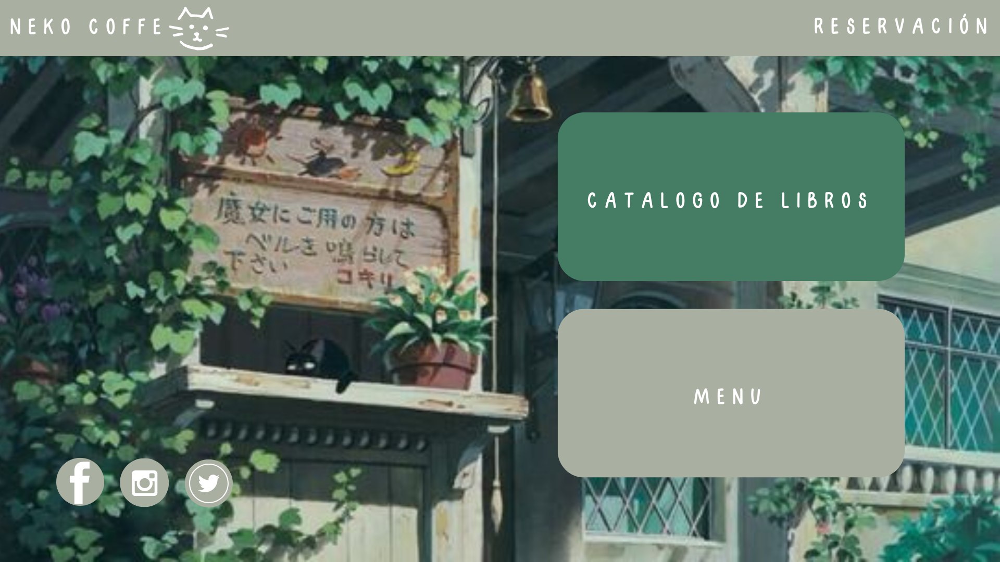
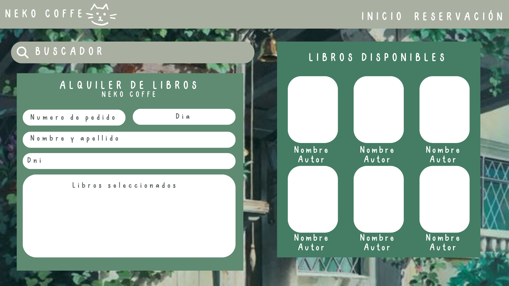
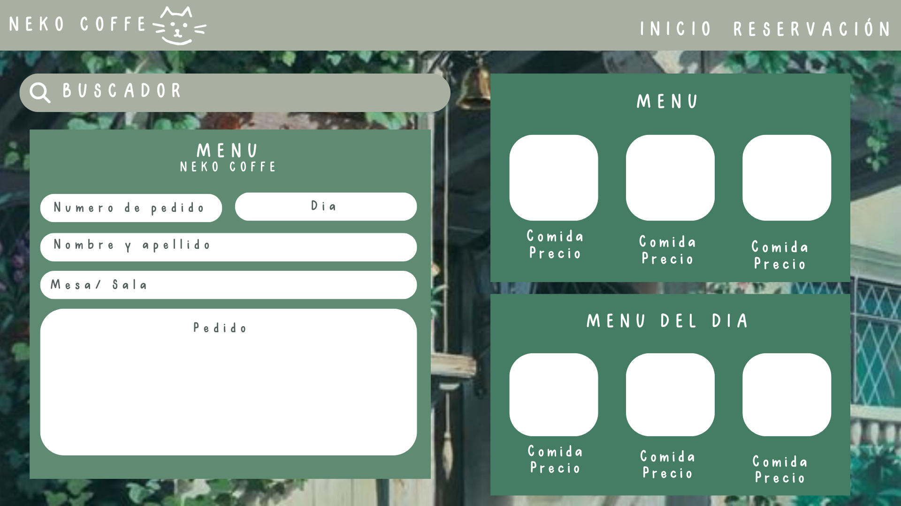
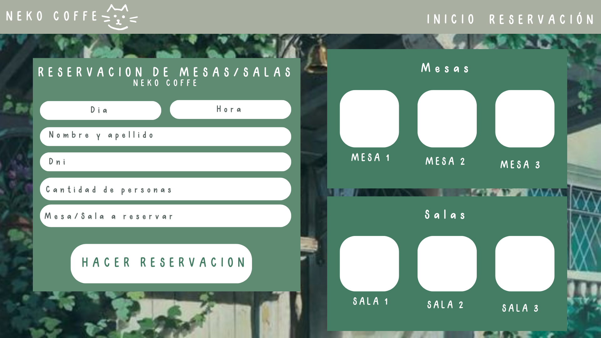

# Cafetería Literaria "NEKO COFFE"

.png)

Bienvenido/a a "NEKO COFFE". Esta es una página web dedicada a combinar el placer de disfrutar un buen café con el amor por la lectura y los gatitos.

## Instalación

1. Clona este repositorio en tu máquina local.
2. Abre el archivo `index.html` en tu navegador web.

## Uso

En nuestra página web, puedes:

- Explorar nuestro menú de café y delicias
- Contactarnos para reservar una mesa o realizar un pedido especial.
- Ver los libros disponibles para alquilar o comprar para acompañar tu rico café

## Contribuir

¡Agradecemos tu interés en contribuir al proyecto! Si tienes sugerencias de mejoras, ideas para nuevos eventos o deseas reportar algún problema, por favor abre un issue o envía una pull request.

## Imagenes

A continuación, se muestran algunas imágenes de los borradores de nuestra página web:

Este es nuestro borrador actual y el cual nos guiamos para realizar el diseño de la pagina.

## Créditos

Este proyecto fue creado por Selena Cumana, Shekina Navarro, Mashely Salome Y Johana Perez. Está inspirado en la pasión por el café y la literatura.

## Contactanos

*Selena:* selenamagdane@gmail.com

__¡Gracias por visitar la Cafetería Literaria "NEKO COFFE"! Disfruta de tu estadía virtual y no dudes en contactarnos si tienes alguna pregunta o comentario.__
